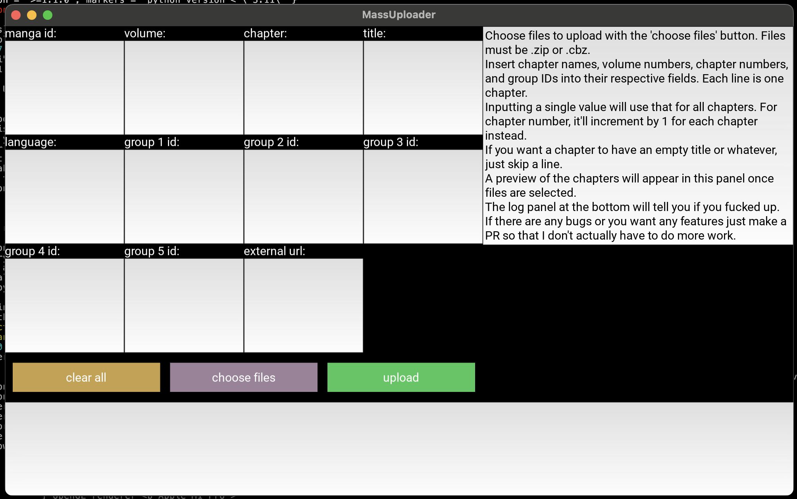
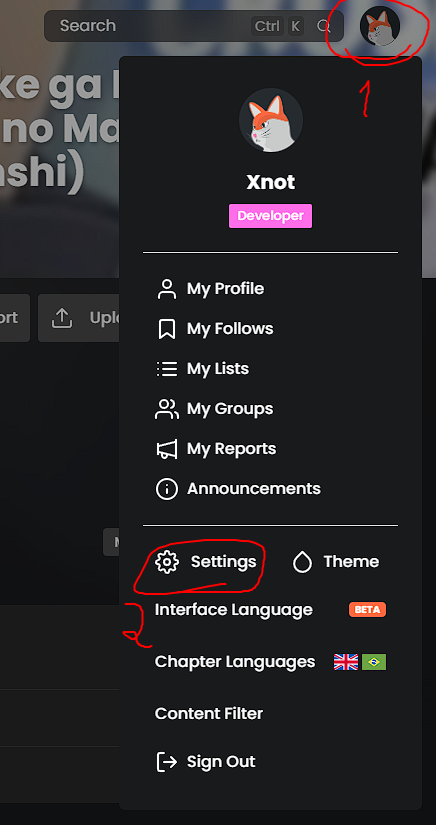
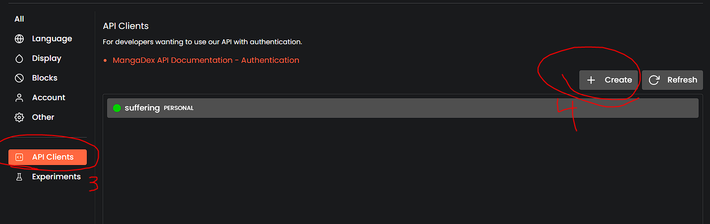

# Mangadex Mass Uploader: Not A Userscript Edition

## Description
This is a GUI tool to aid those who wish to farm 500 chapter uploads on [MangaDex](https://mangadex.org), but are not
autistic enough to use the command line tools that other people have made. This will allow you to obtain the legendary
`Power Uploader` role, granting greater editing privileges on the website, access to secret channels on the Discord
server where you can make connections with upper members of the scanlation cabal, an exclusive membership to Miku
Central, and the ability to flex on standard users. This script is only tested on Windows.

There's also a mass editor tool included, because I know you make mistakes often.

If there are any bugs or you want any features just make a PR so that I don't actually have to do more work.

  
Preview

  

## Installation
### Windows
1. Download and run the executable from the releases page.
2. If Windows Defender complains, tell it to fuck off. Just trust me bro.
### Linux
1. Install python 3.10.
2. Install poetry.
3. I assume the average linux user knows how to clone this repo.
4. `poetry install` in the repo folder.
5. `poetry run python main.py` in the `mangadex_mass_uploader` sub-folder.
###  Mac OS
1. Follow the linux instructions, use `poetry install --with mac` instead, and pray for the best.

## Usage
### Creating an API client
1. Go to your user settings on MangaDex, and into the API Clients section.
2. Create a new client. You'll have to wait for it to be approved (do not contact staff members about this, just wait).
3. Once your client is approved, you can click it to get its ID and secret to login through the app.

  
For the unwise

  
  

### Uploader
1. Choose files to upload with the 'choose files' button. Files must be `.zip` or `.cbz`.
2. Insert the chapter information into the respective fields. Each line is one chapter. For the language field, you must
use the language codes [as described in the API documentation](https://api.mangadex.org/docs/3-enumerations/#language-codes--localization).
3. Inputting a single value will use that for all chapters. For chapter number, it'll increment by 1 for each chapter
instead. If you want to avoid that, leave an extra empty line.
4. If you want a chapter to have an empty title or whatever, just skip a line.
5. A preview of the chapters will appear in the panel on the right.

### Editor
1. Choose chapters to edit using the filters in the initial screen.
2. Manga and uploader can only take 1 input, the others are 1 per line (blame the API).
3. Filters left empty will not be used. To filter by `null` values, leave an extra empty line.
4. The chapter filter supports ranges, like `1-5` to select all chapters between 1 and 5.
5. Use the preview button to see what the current filters are selecting.
6. Confirm the selection to go to the editing screen.
7. On the editing screen, each line will edit each chapter in the order they appear. Empty lines will be skipped. If you
want to set a value to `null`, use a space. The preview will update according to the edited values.
8. Entering a single line will use that value for all selected chapters. If you want to avoid that, leave an extra empty
line.
9. Multiple groups can be added to a single chapter by comma-separating them.
10. In the volume field, you can also assign volume numbers to a specific chapter number or range like `1:1-5` to assign
volume 1 to all chapters between 1 and 5.

### Configuration
After running the app once, a config file will be created at `<HOME_DIRECTORY>/.md_mass_uploader/config.ini`
(`C:/Users/<USERNAME>` on windows). You may edit this file to change things such as the initial window size and
position. Check the
[kivy documentation](https://kivy.org/doc/stable/api-kivy.config.html#available-configuration-tokens) for an explanation
of the available options.
